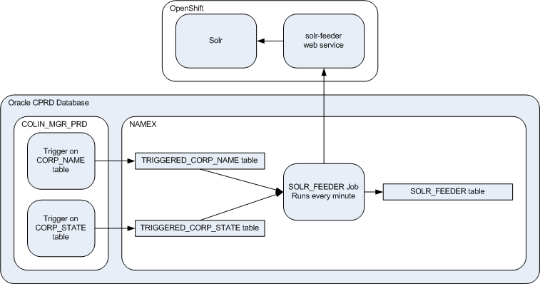
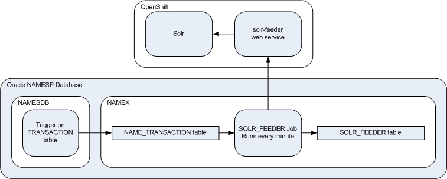

# Solr Feeder

This web service updates the Solr cores in response to changes in the legacy Oracle databases. It is a simple
pass-through web service with no smarts whatsoever, all the logic is in the Oracle database. This means that Oracle
needs to know a lot about Solr, but it was the better of two bad options.

Feeding from CPRD:



Feeding from NAMESP:



#### Flask Secret Key

This application requires a Flask `SECRET_KEY` to do secure cookie hashing. Never commit keys to the repository, and
never use a key in more than one namespace. The application deployment will read the key from an OpenShift secret. In a
Python console:

```
>>> import os, binascii

>>> binascii.hexlify(os.urandom(24))
b'[big_long_key_in_hex]'
```

Copy the `big_long_key_in_hex` and create a secret in OpenShift (make sure you're in the right project):

```
C:\> oc create secret generic solr-feeder --from-literal=flask-secret-key=[big_long_key_in_hex]
```

#### Deficiencies - Code

1. Authorization is missing. Some options are keycloak, static bearer tokens, or client certificates  
1. Configure logging of info for the app and warn of all else
1. Change the solr.update_core log statement from debug to info
1. Set the host in app.py to 0.0.0.0 but link in PyCharm doesn't work (use localhost)
1. Add version numbers to requirements.txt
1. Fix the warning for the dotenv import in config.py
1. Fix desktop to run on port 8080, not 5000
